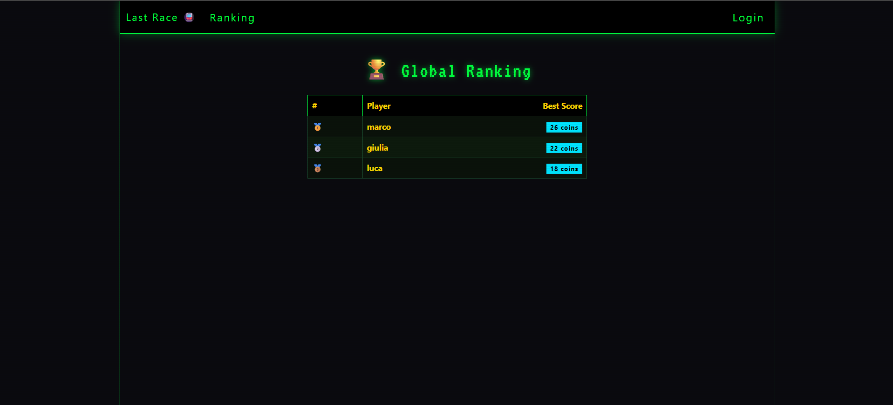

# Exam #1: "Last Race"
## Student: s343402 Santona Gabriele

## React Client Application Routes

- Route `/`: Home page. Anonymous users see game instructions. Logged-in users see the instructions plus a "Play Now" button.
- Route `/login`: Login form. Redirects to `/` if already authenticated.
- Route `/ranking`: Global ranking table showing each player's best score. Accessible to all users.
- Route `/game`: Protected game page (requires login). Hosts the full game state machine: Setup → Planning → Execution → Result.

## API Server

- `POST /api/sessions`
  - Body: `{ username, password }`
  - Response 200: `{ id, username }` | 401 on wrong credentials
- `DELETE /api/sessions/current`
  - Requires authentication. Logs out the current user.
  - Response 200: `{}`
- `GET /api/sessions/current`
  - Response 200: `{ id, username }` | 401 if not authenticated
- `GET /api/network/full`
  - Requires authentication. Returns the complete network for the Setup phase.
  - Response 200: `{ stations: [{id, name}], lines: [{id, name, color, stations: [ids], segments: [{station_a, station_b}]}] }`
- `GET /api/network/segments`
  - Requires authentication. Returns all segments (without line attribution) for the Planning phase.
  - Response 200: `{ segments: [{station_a_id, station_a_name, station_b_id, station_b_name}] }`
- `GET /api/network/stations`
  - Requires authentication. Returns station names only for the Planning phase map.
  - Response 200: `{ stations: [{id, name}] }`
- `POST /api/games`
  - Requires authentication. Starts a new game; server randomly assigns start and destination (BFS distance ≥ 3).
  - Response 201: `{ gameId, start: {id, name}, destination: {id, name} }`
- `POST /api/games/:id/submit-route`
  - Requires authentication. Validates the submitted route and, if valid, executes it server-side (picks a random event per segment). If invalid, returns score 0.
  - Body: `{ route: [{station_a_id, station_b_id}] }`
  - Response 200: `{ valid: true, score, steps: [{position, station_a, station_b, event: {id, description, effect}, coins_after}] }` or `{ valid: false, score: 0 }`
- `GET /api/ranking`
  - Public. Returns each user's best score across all completed games.
  - Response 200: `{ ranking: [{username, best_score}] }`

## Database Tables

- Table `users` — stores registered users: id, username, bcrypt-hashed password
- Table `lines` — metro lines: id, name, CSS color hex string
- Table `stations` — metro stations: id, name
- Table `line_stations` — which stations belong to which line and their order (position); consecutive positions define segments
- Table `events` — random events: id, description, integer effect (–4 to +4)
- Table `games` — game records: id, user_id, start_id, destination_id, score, completed_at (NULL while in progress)
- Table `game_segments` — route segments per game: position, station_a_id, station_b_id, event_id (filled during execution), coins_after

## Main React Components

- `App` (in `App.jsx`): Root component. Sets up AuthProvider, BrowserRouter, and all routes.
- `AuthProvider` (in `contexts/AuthContext.jsx`): Provides user state and login/logout functions via context.
- `NavigationBar` (in `components/NavigationBar.jsx`): Bootstrap Navbar with app title, ranking link, and login/logout controls.
- `ProtectedRoute` (in `components/ProtectedRoute.jsx`): Auth guard — redirects to /login if user is not authenticated.
- `LoginPage` (in `pages/LoginPage.jsx`): Login form with validation and error display.
- `HomePage` (in `pages/HomePage.jsx`): Landing page showing game instructions; "Play Now" button for logged-in users.
- `RankingPage` (in `pages/RankingPage.jsx`): Fetches and displays the global best-score ranking table.
- `GamePage` (in `pages/GamePage.jsx`): Phase state machine (setup → planning → execution → result). Orchestrates all API calls.
- `SetupPhase` (in `game/SetupPhase.jsx`): Shows the full network map (all lines + stations). "Ready" button starts the game.
- `PlanningPhase` (in `game/PlanningPhase.jsx`): 90-second countdown, station list (no line info), segment picker, submit button.
- `ExecutionPhase` (in `game/ExecutionPhase.jsx`): Reveals journey steps one at a time, showing each event and updated coin total.
- `ResultPhase` (in `game/ResultPhase.jsx`): Displays final score and offers a "Play Again" button.
- `NetworkMap` (in `game/NetworkMap.jsx`): Reusable map component; `showLines=true` renders coloured line diagrams, `showLines=false` renders station names only.
- `SegmentPicker` (in `game/SegmentPicker.jsx`): Interactive segment list for building the route; highlights the current route chain and lists all unused segments for selection.
- `Timer` (in `game/Timer.jsx`): 90-second countdown with progress bar; fires `onExpire` callback when time runs out.

## Screenshot

## Users Credentials

| Username | Password    |
|----------|-------------|
| marco    | password123 |
| giulia   | sicura456   |
| luca     | metro789    |

## Use of AI Tools

Claude Code (Anthropic) was used to help design the architecture, write boilerplate, and structure components. All generated code was reviewed, understood, and adapted. Route validation logic and state management decisions were reasoned through independently during development.
